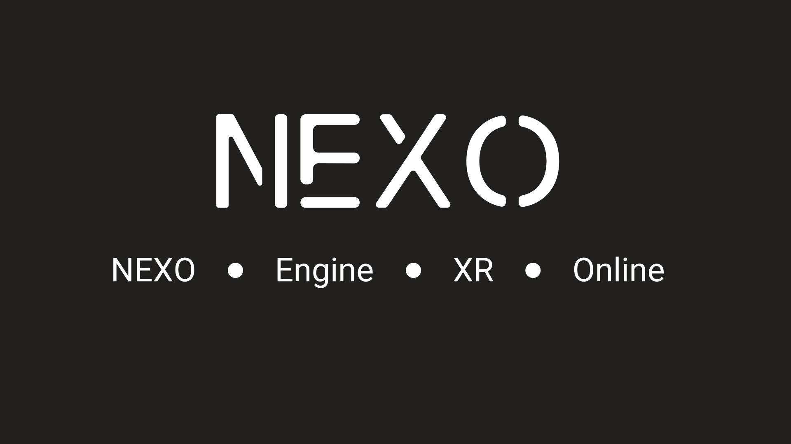

<h1 align="center">
  <picture>
    <source media="(prefers-color-scheme: dark)" srcset="logo_nexo_horizontal_title_only_white.png" width="500">
    <source media="(prefers-color-scheme: light)" srcset="logo_nexo_horizontal_title_only.png" width="500">
    
  </picture>
</h1>

<h3 align="center">Welcome!</h3>

Designs and logos of Nexo Engine

Here are all asset names, located at the root of the repo:

<table>
  <tr>
    <td align="center"></td>
    <td align="center">NEXO.ai</td>
  </tr>
  <tr>
    <td align="center"></td>
    <td align="center">NEXO.svg</td>
  </tr>
  <tr>
    <td align="center"></td>
    <td align="center">logo_nexo.png</td>
  </tr>
  <tr>
    <td align="center"></td>
    <td align="center">logo_nexo_fond.png</td>
  </tr>
  <tr>
    <td align="center"></td>
    <td align="center">logo_nexo_horizontal_subtitle.png</td>
  </tr>
  <tr>
    <td align="center"></td>
    <td align="center">logo_nexo_horizontal_subtitle_white.png</td>
  </tr>
  <tr>
    <td align="center"></td>
    <td align="center">logo_nexo_horizontal_title_only.png</td>
  </tr>
  <tr>
    <td align="center"></td>
    <td align="center">logo_nexo_horizontal_title_only_white.png</td>
  </tr>
</table>
